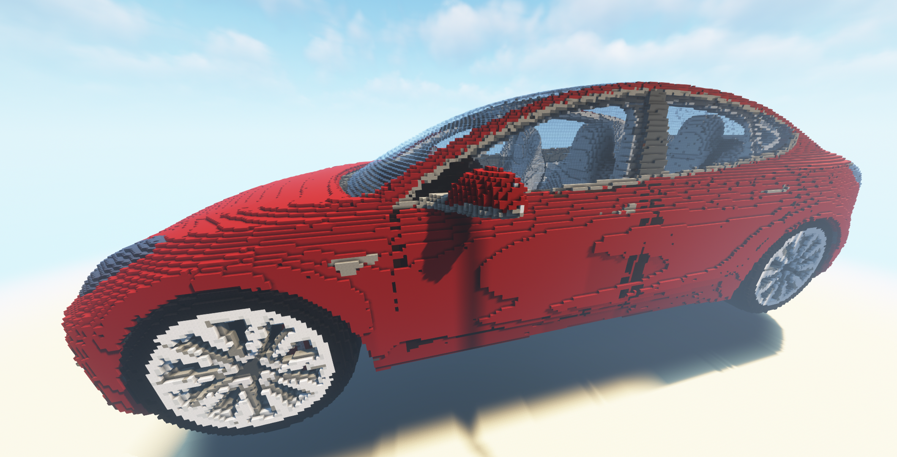
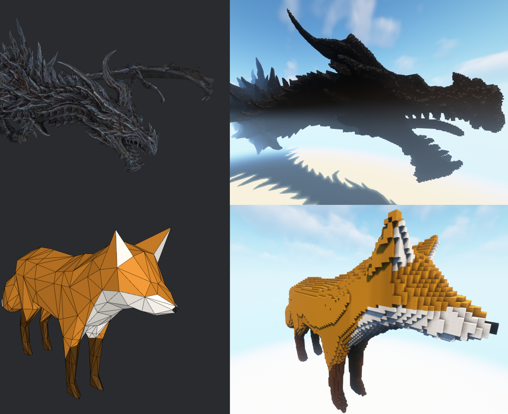

# Voxelizer

**Voxelizer** is a Minecraft server plugin which generates 3D model representations in Minecraft.

# Overview

To achieve this, the plugin executes following steps:

1. Load and parse a .obj 3d model file (containing the mesh) and the corresponding .mtl file (containing the materials) to get the vertices, triangles, uv coordinates and materials of the model
2. "Voxelize" every triangle (heart of the plugin); explained in more detail below
3. Spawn build tasks to build the voxels in the Minecraft world

## "Voxelizing"

Voxelizing is done by iterating over every triangle in the mesh (multithreaded). For every block in the bounding box of the triangle we have to check if that block's distance to the 3d plane of the triangle is less than the specified thickness. If this is the case, we also have to check if that block lies inside the triangle. This is done by projecting the blocks 3d coordinates onto a 2d coordinate system spanned by the triangle. Then a simple edge function is applied to that point to check if the point (and so the block) is inside the triangle (see rasterization for more detail). The next step is to calculate the color and find the closest matching Minecraft material for every block inside the triangle (see below).

## Material mapping

To find the closest matching material, we first have to calculate the corresponding pixel in the triangle's material to look up the desired color for the voxel's material. This is done by calculating the barycentric coordinates (the relative coordinates of the point (the projected block) in the triangle) and using them to interpolate the uv coordinates (texture coordinates) given by the vertices. Now we can look up the RGBA value of the texture at the calculated uv coordinates.

The next step is comparing the desired color to the colors of the Minecraft materials to find the closest matching material. The color of the Minecraft building materials are precalculated and stored in an array of possible building materials. Comparing two colors is pretty difficult because the sRGB color space doesn't really match the human's perception, so in order to compare two colors respecting the human's perception, we have to convert the colors to a different color space, namely the CIE-Lab color space. In this color space it's easier to calculate the difference between two colors, by using one of the delta E formulas. Now we just have to calculate the delta E value for every material and choose the one with the lowest delta E. If the color is a bit transparent, there's a second list containing just Minecraft's colored glass blocks to choose the material from.

# Using the plugin

The release section contains the packaged .jar file which you can simply drag & drop inside your PaperMC / Spigot Minecraft server's plugin directory. To use a .obj 3d model, you have to put it (along with it's .mtl file and texture files) somewhere inside the generated `plugins/Voxelizer` folder. It can then be voxelized by executing the `/voxelize` command inside Minecraft.
